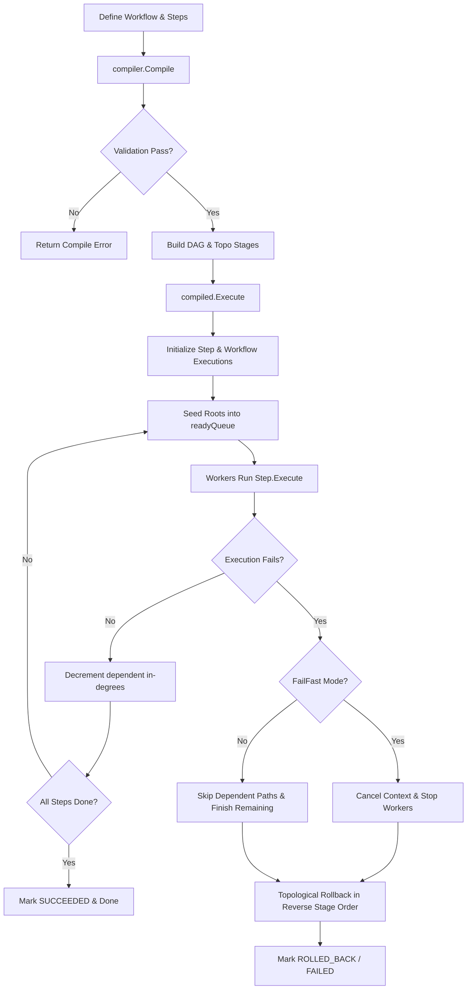
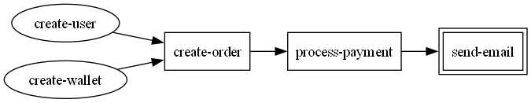
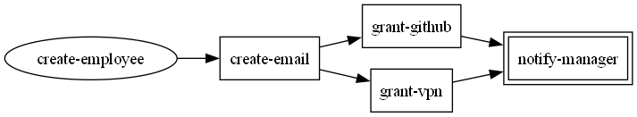
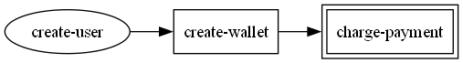
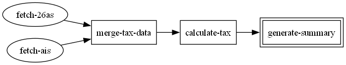
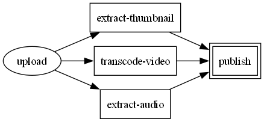

# Flow Forge

A production-grade, concurrent workflow execution engine for Go. It allows developers to define multi-step workflows as Directed Acyclic Graphs (DAGs), run independent steps concurrently using a worker pool, retry failing steps with exponential backoff and jitter, and automatically roll back completed steps on failure using the Saga pattern.

---

## Table of Contents
- [Features](#features)
- [Architecture & Design](#architecture--design)
- [Installation](#installation)
- [Quick Start](#quick-start)
- [Core Concepts](#core-concepts)
  - [Workflow & Steps](#workflow--steps)
  - [State Sharing (WorkflowContext)](#state-sharing-workflowcontext)
  - [Retry Policy](#retry-policy)
  - [Compiler](#compiler)
  - [Scheduler & Workers](#scheduler--workers)
  - [Saga-pattern Rollbacks](#saga-pattern-rollbacks)
- [Execution Configurations](#execution-configurations)
  - [Execution Options](#execution-options)
  - [Event Sinks](#event-sinks)
  - [Persistence Store](#persistence-store)
- [Visualization](#visualization)
- [Real-World Examples](#real-world-examples)
  - [1. E-Commerce Order Flow](#1-e-commerce-order-flow)
  - [2. Employee Onboarding](#2-employee-onboarding)
  - [3. Payment Failure & Rollback](#3-payment-failure--rollback)
  - [4. Tax Processing Pipeline](#4-tax-processing-pipeline)
  - [5. Video Processing Pipeline](#5-video-processing-pipeline)
- [Testing](#testing)
- [License](#license)

---

## Features

- **DAG-based Execution** — Declare step-level dependencies; the engine constructs the dependency graph and executes independent steps in parallel.
- **Saga Pattern Rollback** — If a workflow fails, the engine runs compensating transactions (`Rollback` functions) in reverse topological order.
- **Retry with Exponential Backoff** — Configurable per-step retries with random jitter to prevent "thundering herd" issues.
- **Bounded Worker Pool** — Control runtime concurrency via a configurable limit on the number of worker goroutines.
- **Pluggable Architecture** — Intercept lifecycle events with custom event sinks and persist execution states with abstract store interfaces.
- **Visualization** — Compile and export workflows to Graphviz DOT format to generate visual representations.

---

## Architecture & Design

### Directory Structure
```text
workflow_engine/
├── cmd/
│   └── app/
│       └── main.go                  # Example application entrypoint
├── examples/
│   ├── ecommerce_order/             # E-commerce checkout workflow example
│   ├── employee_onboarding/         # Employee registration workflow example
│   ├── payment_failure_rollback/    # Saga pattern rollback behavior demonstration
│   ├── tax_processing_pipeline/     # Data pipelining workflow example
│   └── video_processing/            # Heavy fan-out/fan-in processing example
└── internal/
    ├── logger/                      # Standard structured logging utilities (slog)
    └── workflow/
        ├── compiler/                # Validates workflow & generates CompiledWorkflow
        ├── dag/                     # Graph builder, cycle detector, scheduler, DOT visualizer
        ├── errs/                    # Domain sentinel errors
        ├── events/                  # Lifecycle events & Sink interface
        ├── execution/               # Progress tracking & Store interfaces
        ├── retry/                   # Backoff logic
        ├── runtime/                 # WorkflowContext with shared storage (sync.Map)
        ├── state/                   # Enums for Step and Workflow states
        ├── execution_options.go     # Execution parameters
        ├── execution_result.go      # Results carrier
        ├── failurePolicy.go         # Concurrency fail policies
        ├── step.go                  # Single execution block properties
        └── workflow.go              # Workflow registry container
```

---

### Workflow Execution Lifecycle


---

## Quick Start

```go
package main

import (
	"fmt"
	"time"
	"workflow_engine/internal/logger"
	"workflow_engine/internal/workflow"
	"workflow_engine/internal/workflow/compiler"
	"workflow_engine/internal/workflow/retry"
	"workflow_engine/internal/workflow/runtime"
)

func main() {
	// 1. Initialize structured logging
	logger.Init()

	// 2. Create the execution context
	ctx := runtime.NewWorkflowContext()
	defer ctx.Cancel()

	// 3. Define the workflow
	wf := workflow.NewWorkflow()

	_ = wf.AddStep(&workflow.Step{
		Name:  "create-user",
		Retry: retry.NewRetryPolicy(3, 100*time.Millisecond, time.Second, 0.5),
		Execute: func(ctx *runtime.WorkflowContext) error {
			fmt.Println("User created successfully!")
			ctx.Data.Store("user_id", "usr_99824") // Share state
			return nil
		},
		Rollback: func(ctx *runtime.WorkflowContext) error {
			fmt.Println("Rolling back user creation...")
			return nil
		},
	})

	_ = wf.AddStep(&workflow.Step{
		Name:      "create-profile",
		DependsOn: []string{"create-user"},
		Execute: func(ctx *runtime.WorkflowContext) error {
			userID, _ := ctx.Data.Load("user_id")
			fmt.Printf("Creating profile for user ID: %v\n", userID)
			return nil
		},
	})

	// 4. Compile the workflow
	compiled, err := compiler.Compile(wf)
	if err != nil {
		panic(err)
	}

	// 5. Execute with default configuration
	result := compiled.Execute(wf, ctx, workflow.DefaultExecutionOptions())
	fmt.Printf("Workflow Result State: %s\n", result.State)
}
```

---

## Core Concepts

### Workflow & Steps
A `Workflow` acts as a registry. You register `Step` pointer references that represent execution nodes.
- **`Name`**: Unique identifier for the step.
- **`DependsOn`**: Array of step names that must complete successfully before this step can begin execution.
- **`Execute`**: The main Go function containing your business logic.
- **`Rollback`**: Compensation function triggered only if the workflow fails *after* this step successfully completed.

### State Sharing (WorkflowContext)
Workflows run concurrently, making standard global variables unsafe for sharing step outputs. Instead, steps use the thread-safe `ctx.Data` (backed by a `sync.Map`) found within `runtime.WorkflowContext`:
```go
// Step 1: Write Data
ctx.Data.Store("token", "xyz123")

// Step 2: Read Data
if val, ok := ctx.Data.Load("token"); ok {
    token := val.(string)
}
```

### Retry Policy
Configure per-step execution resilience using `retry.NewRetryPolicy`. 
```go
retry.NewRetryPolicy(maxAttempts, baseBackoff, maxBackoff, minPercentFloor)
```
- **Backoff calculation**: `baseBackoff * 2^(attempt-1)`, clamped to `maxBackoff`.
- **Jitter**: Introduces randomness between `minPercentFloor` (e.g., `0.5` for 50%) and `1.0` of the computed backoff to distribute retry attempts.

### Compiler
Before execution, `compiler.Compile(wf)` checks graph health:
- Resolves all dependency names.
- Scans for self-dependencies, duplicates, and cycles.
- Creates topological layers (execution stages) that group steps that can run concurrently.

### Scheduler & Workers
The scheduler initializes a worker pool of size `MaxWorkers`. It monitors in-degrees of all steps. When a step finishes, it updates all dependent steps. When a dependent's in-degree drops to `0`, it is fed to the workers.

### Saga-pattern Rollbacks
If a step fails:
1. **FailFast**: The scheduler cancels the context, halting any pending tasks.
2. **ContinueOnFailure**: Let independent paths finish, but prevent descendants of failed nodes from starting.
3. Once current steps finish, the compiler triggers `Rollback` handlers of all completed steps.
4. Rollbacks run **backwards** through the compiled topological layers, running rollbacks within each layer concurrently before moving to the parent layer.

---

## Execution Configurations

### Execution Options
Customize engine performance:
```go
opts := &workflow.ExecutionOptions{
    MaxWorkers:    16,                         // Concurrency limit
    FailurePolicy: workflow.ContinueOnFailure, // Or FailFast
    EventSink:     myEventSink,                // Custom Event sink
    Store:         myPersistenceStore,         // Custom persistent history
}
```

### Event Sinks
Create custom pipelines (e.g., Prometheus, Datadog, Slack alerts) by implementing `events.Sink`:
```go
type Sink interface {
    Publish(Event)
}
```
Built-in sinks:
- `events.NewLoggerSink()`: structured output using the standard library's `slog`.

### Persistence Store
Persist workflow progress to external databases (PostgreSQL, Redis, etc.) by implementing `execution.Store`:
```go
type Store interface {
    Save(wfCtx *runtime.WorkflowContext, exec *WorkflowExecution) error
    Update(wfCtx *runtime.WorkflowContext, exec *WorkflowExecution) error
    Get(wfCtx *runtime.WorkflowContext, runId string) (*WorkflowExecution, error)
    List(wfCtx *runtime.WorkflowContext, query Query) ([]*WorkflowExecution, error)
    Delete(wfCtx *runtime.WorkflowContext, runId string) error
}
```
Built-in stores:
- `execution.NewMemoryStore()`: thread-safe, in-memory execution cache.

---

## Visualization

You can generate Graphviz DOT configurations from any `CompiledWorkflow`:

```go
err := compiled.ExportVisualization("workflow.dot", &dag.VisualizationOptions{
    Direction:  "LR", // LR (Left-to-Right) or TB (Top-to-Bottom)
    ShowRoots:  true,
    ShowLeaves: true,
})
```

Render the DOT file into a high-quality PNG layout using standard command-line tools:
```bash
dot -Tpng workflow.dot -o workflow.png
```
*Visual indicators:*
- **Ellipse**: Entry points (Root nodes).
- **Double Border Box**: Terminus points (Leaf nodes).
- **Standard Box**: Intermediary processing steps.

---

## Real-World Examples

The codebase includes working demonstration apps inside the `examples/` directory.

### 1. E-Commerce Order Flow
Located at `examples/ecommerce_order/main.go`. It represents a checkout pipeline where user accounts and digital wallets are created concurrently, followed by order placement, payment, and notifications.

**Workflow Visualization:**


**Step Definitions:**
```go
// 1. Create User (Root)
wf.AddStep(&workflow.Step{
    Name:  "create-user",
    Retry: retry.NewRetryPolicy(3, time.Second, 5*time.Second, .5),
    Execute: func(ctx *runtime.WorkflowContext) error { ... },
    Rollback: func(ctx *runtime.WorkflowContext) error { ... },
})

// 2. Create Wallet (Root)
wf.AddStep(&workflow.Step{
    Name:  "create-wallet",
    Retry: retry.NewRetryPolicy(3, time.Second, 5*time.Second, .5),
    Execute: func(ctx *runtime.WorkflowContext) error { ... },
    Rollback: func(ctx *runtime.WorkflowContext) error { ... },
})

// 3. Create Order (Depends on User & Wallet)
wf.AddStep(&workflow.Step{
    Name:      "create-order",
    DependsOn: []string{"create-user", "create-wallet"},
    Retry:     retry.NewRetryPolicy(3, time.Second, 5*time.Second, .5),
    Execute:   func(ctx *runtime.WorkflowContext) error { ... },
    Rollback:  func(ctx *runtime.WorkflowContext) error { ... },
})

// 4. Process Payment (Depends on Order)
wf.AddStep(&workflow.Step{
    Name:      "process-payment",
    DependsOn: []string{"create-order"},
    Retry:     retry.NewRetryPolicy(3, time.Second, 5*time.Second, .5),
    Execute:   func(ctx *runtime.WorkflowContext) error { ... },
    Rollback:  func(ctx *runtime.WorkflowContext) error { ... },
})

// 5. Send Email Notification (Depends on Payment - Leaf)
wf.AddStep(&workflow.Step{
    Name:      "send-email",
    DependsOn: []string{"process-payment"},
    Retry:     retry.NewRetryPolicy(1, time.Second, time.Second, .5),
    Execute:   func(ctx *runtime.WorkflowContext) error { ... },
})
```

---

### 2. Employee Onboarding
Located at `examples/employee_onboarding/main.go`. This example shows how corporate workflows spawn parallel access provisioning for multiple corporate assets (GitHub, VPN) after a profile is set up.

**Workflow Visualization:**


**Step Definitions:**
```go
add(step("create-employee")) // Root
add(step("create-email", "create-employee"))
add(step("grant-github", "create-email"))
add(step("grant-vpn", "create-email"))
add(step("notify-manager", "grant-github", "grant-vpn")) // Leaf
```

---

### 3. Payment Failure & Rollback
Located at `examples/payment_failure_rollback/main.go`. This demonstrates the **Saga Pattern rollback execution**. It builds a simple pipeline that fails during the payment processing stage, triggering reverse topological rollbacks.

**Workflow Visualization:**


**Run Behavior:**
1. `create-user` succeeds.
2. `create-wallet` succeeds.
3. `charge-payment` executes and intentionally returns a `payment declined` error.
4. Execution halts.
5. Compensation logic kicks off:
   - `delete-wallet` (Rollback of `create-wallet`) is triggered.
   - `delete-user` (Rollback of `create-user`) is triggered in the next stage.
6. Execution result is marked as `ROLLED_BACK`.

---

### 4. Tax Processing Pipeline
Located at `examples/tax_processing_pipeline/main.go`. A data collection and calculation workflow showing parallel data extraction stages feeding into a single calculation step.

**Workflow Visualization:**


**Step Definitions:**
```go
add(create("fetch-ais"))  // Parallel fetch root 1
add(create("fetch-26as")) // Parallel fetch root 2
add(create("merge-tax-data", "fetch-ais", "fetch-26as"))
add(create("calculate-tax", "merge-tax-data"))
add(create("generate-summary", "calculate-tax"))
```

---

### 5. Video Processing Pipeline
Located at `examples/video_processing/main.go`. Demonstrates heavy "fan-out" and "fan-in" topologies. An uploaded video file spawns three concurrent processing tasks (audio extraction, thumbnail creation, video transcoding) before completing.

**Workflow Visualization:**


**Step Definitions:**
```go
add("upload") // Root
add("extract-audio", "upload")
add("extract-thumbnail", "upload")
add("transcode-video", "upload")
add("publish", "extract-audio", "extract-thumbnail", "transcode-video") // Leaf
```

---

## Testing & Benchmarks

### Running Tests
Execute the workflow engine test suite using standard Go test tools:

```bash
go test ./...
```

The test coverage includes DAG build validations, topological layer sorting, cycle detection checks, and worker execution correctness.

### Running Benchmarks
We maintain a comprehensive suite of benchmarks under `internal/benchmark` measuring compilation, parallel execution topologies, persistence overhead, and reverse topological rollback. Run them with:

```bash
go test ./internal/benchmark -bench="." -benchmem
```

#### Reference Benchmark Metrics
Tested on an Intel(R) Core(TM) i7-10510U CPU (4 Cores, 8 Threads) at 1.80GHz running Go 1.26 on Windows:

| Benchmark Name | Iterations | Latency (ns/op) | Memory (B/op) | Allocations (allocs/op) | Description |
| :--- | :---: | :---: | :---: | :---: | :--- |
| **`BenchmarkCompile100`** | 17,492 | 82,374 ns | 46,976 B | 747 | Compiles 100-step linear DAG |
| **`BenchmarkCompile1000`** | 1,303 | 1,298,466 ns | 571,571 B | 7,086 | Compiles 1,000-step linear DAG |
| **`BenchmarkExecuteParallel_100Nodes_10Workers`** | 2,755 | 703,241 ns | 59,095 B | 668 | Pure scheduling cost for 100 parallel steps |
| **`BenchmarkExecuteParallel_1000Nodes_32Workers`** | 231 | 6,055,169 ns | 645,539 B | 6,139 | Pure scheduling cost for 1,000 parallel steps |
| **`BenchmarkExecuteDiamond_100Nodes_10Workers`** | 2,685 | 449,728 ns | 56,898 B | 660 | Diamond topology (fan-out/fan-in) execution |
| **`BenchmarkExecuteWithStore_100Nodes_10Workers`** | 2,352 | 443,297 ns | 59,429 B | 672 | Execution with Memory Store persistence |
| **`BenchmarkRollback100`** | 523 | 2,072,801 ns | 64,896 B | 991 | Reverse topological rollback of 100 steps |

#### Concurrency & Worker Scaling Performance
By introducing a simulated workload delay of **100 microseconds per step**, we can analyze how the engine's worker pool scales.

| Concurrency Profile | Latency (ms/op) | Parallel Speedup | Efficiency |
| :--- | :---: | :---: | :---: |
| **1 Worker** (sequential baseline) | 74.20 ms | 1.00x | 100% |
| **2 Workers** | 35.27 ms | 2.10x | >100% (due to thread interleaving) |
| **4 Workers** | 18.82 ms | 3.94x | 98.5% |
| **8 Workers** (max hardware threads) | 10.19 ms | 7.28x | 91.0% |
| **16 Workers** (oversubscribed) | 5.76 ms | 12.87x | - |
| **32 Workers** (oversubscribed) | 3.20 ms | 23.18x | - |

---

**Key Takeaways:**
1. **Linear Concurrency Scaling**: Reached a **23.18x speedup** on 32 workers (reducing runtime from 74.20ms to 3.20ms) for independent parallel tasks.
2. **Minimal Synchronization Overhead**: Core engine scheduling adds only **~7 microseconds** of coordination overhead per step (as shown by `BenchmarkExecuteParallel_100Nodes_10Workers` at 703µs total for 100 steps).
3. **Optimized Persistence Footprint**: Enabling persistence store state updates adds negligible overhead (~100 bytes and 4 allocs per run).

---

## License

This project is licensed under the [MIT License](LICENSE).
